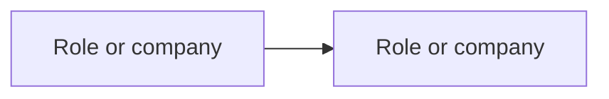

# Company Tech Research

Use this skill to build evidence-backed company research around a technology, market, supply chain, product category, or emerging technical trend. Research from the technology question outward unless the user explicitly asks to start from a named company.

## Operating mode

Treat the current directory as the research workspace. Create files lazily under `research/`; do not scaffold empty folders or duplicate profiles just because a company belongs to multiple categories.

Canonical research files:

- `research/companies/<company-slug>.md`: one profile per company.
- `research/technologies/<technology-slug>.md`: one ecosystem map per technology.
- `research/indexes/by-technology/<technology-slug>.md`: company comparison for a technology.
- `research/indexes/by-role/<role-slug>.md`: role-based company index.
- `research/indexes/by-theme/<theme-slug>.md`: cross-cutting theme index.
- `research/evidence/source-log.md`: source ledger for material evidence.

Use tags and index files for multi-category membership. Never create separate copies of the same company profile under category folders.

## Slugs and company identity

Use lowercase kebab-case slugs for research files. Prefer stable company or technology names over tickers unless the ticker is the common name:

- `sk-hynix.md`
- `samsung-electronics.md`
- `micron.md`
- `nvidia.md`
- `tsmc.md`

Choose one canonical slug and put aliases, tickers, subsidiary names, and former names inside the profile. Do not create duplicate profiles for ticker aliases, subsidiaries, category membership, or region-specific naming unless they are genuinely separate entities for the research question.

When identity affects the conclusion, record:

- legal or common name;
- ticker symbols and exchanges;
- parent, subsidiary, or segment status;
- headquarters or primary jurisdiction;
- aliases, former names, and relevant business units.

When the workspace also uses `teach`, keep lesson artifacts in `lessons/`, `reference/`, `GLOSSARY.md`, and `learning-records/`; keep company research artifacts under `research/`.

## Research question first

Before gathering sources, identify the practical question being answered. Examples:

- Which companies have direct or indirect exposure to HBM growth?
- What role do Micron, Samsung, and SK hynix play in DRAM and HBM?
- Which companies could matter if an emerging memory or storage technology becomes important?
- What is the supply chain for CXL memory, advanced packaging, or AI accelerators?

If the user gives only a broad topic, choose the smallest useful question that advances their stated learning or research mission. Ask only if the technology, company identity, ticker, geography, or time horizon is ambiguous enough to change the result.

## Scope the technology

For each technology research pass, define:

1. The technology name and known aliases.
2. The boundary: what is included and excluded.
3. The current maturity: established, ramping, early commercial, research-stage, or ambiguous.
4. Adjacent or substitute technologies.
5. The ecosystem roles that might matter.

For emerging acronyms or overloaded terms, verify the meaning before mapping companies. Record unresolved acronym ambiguity as an open question instead of treating it as fact.

## Ecosystem roles

Classify each company by role, not by vague relevance. A company may have multiple roles:

- manufacturer;
- supplier;
- customer;
- integrator;
- platform owner;
- IP provider;
- foundry;
- advanced-packaging provider;
- equipment vendor;
- materials supplier;
- hyperscaler or cloud buyer;
- standards participant;
- research lab;
- competitor;
- substitute technology provider;
- bottleneck owner;
- demand driver.

Do not call a company a technology leader, beneficiary, or pure play unless sources support the specific claim.

## Source-first workflow

1. Read existing relevant `research/` files before adding new findings.
2. Read `MISSION.md`, `RESOURCES.md`, or `NOTES.md` if they exist and are relevant to the research question.
3. Find high-trust sources before making factual company claims.
4. Prefer primary sources and current source material when the claim depends on timing.
5. Cross-check important claims against at least one independent or primary source when practical.
6. Update `research/evidence/source-log.md` when a source materially supports a company profile, technology map, comparison, or confidence judgment.

Use read-only external research unless the user explicitly authorizes a write action. Do not create accounts, submit forms, publish, contact companies, mutate remote systems, or trigger workflows as part of this skill without explicit approval.

Source priority:

1. Regulatory filings, annual reports, 10-K, 20-F, and equivalent disclosures.
2. Company product pages, datasheets, technical briefs, and official roadmaps.
3. Earnings call transcripts, investor presentations, and official press releases.
4. Standards bodies, consortium publications, and peer-reviewed papers.
5. Reputable technical teardowns, industry reporting, and analyst material.
6. Patents, job postings, rumors, and social posts only as weak signals unless corroborated.

Source trust levels:

- **Primary-high**: regulatory filing, annual report, audited disclosure, datasheet, standards document, or official technical specification.
- **Primary-medium**: investor presentation, earnings call, official press release, official roadmap, or company-authored marketing/technical brief.
- **Secondary-high**: reputable technical or industry reporting with named sources, direct quotations, documents, or reproducible analysis.
- **Secondary-medium**: analyst note, market summary, trade-press article, or expert commentary that is useful but not independently authoritative.
- **Weak signal**: patent, job posting, rumor, social post, unsourced claim, or inference from hiring/product language.

Citation format for material claims:

- title;
- publisher, company, author, or standards body;
- publication date when available;
- date accessed;
- URL or local path;
- relevant quote, table, slide, page, or section when practical.

Do not rely on parametric memory for factual company claims when source lookup is available. Cite sources in the research files with enough detail for later verification.

## Evidence labels

Separate evidence types explicitly:

- **Fact**: directly supported by a source.
- **Company claim**: stated by the company but not independently verified.
- **Third-party claim**: stated by a non-company source.
- **Inference**: reasoned conclusion from facts or claims.
- **Unknown**: relevant question without sufficient evidence.
- **Rejected**: common or plausible claim that sources do not support.

Never present low-confidence claims, company marketing, rumors, or inference as facts.

## Confidence levels

Assign confidence to material company/technology relationships:

- **High**: primary source or multiple strong sources confirm the role, product, relationship, shipment, or exposure.
- **Medium**: credible evidence supports relevance, but materiality, timing, scale, or customer status remains unclear.
- **Low**: plausible relationship based on weak signals, old sources, patents, job postings, roadmap hints, or uncorroborated secondary claims.
- **Rejected**: investigated claim is unsupported or contradicted by sources.

Name the reason for the confidence level when it affects the conclusion.

## Company profile format

Create or update `research/companies/<company-slug>.md` with only sections that have useful content:

```md
# <Company>

## Snapshot

- Primary roles:
- Relevant technologies:
- Last updated:

## Identity

- Legal or common name:
- Ticker symbols and exchanges:
- Parent, subsidiary, or segment status:
- Headquarters or primary jurisdiction:
- Aliases, former names, and relevant business units:

## Technology exposure

| Technology | Role | Confidence | Evidence |
|---|---|---:|---|
|  |  |  |  |

## Ecosystem position

- Suppliers:
- Customers:
- Competitors:
- Partners:
- Dependencies:
- Bottlenecks owned or exposed to:

## Claims vs evidence

| Statement | Label | Source | Confidence | Notes |
|---|---|---|---:|---|
|  |  |  |  |  |

## Timeline

| Date | Event | Source |
|---|---|---|
|  |  |  |

## Risks and unknowns

- Technical:
- Supply chain:
- Competitive:
- Regulatory or geopolitical:
- Evidence gaps:

## Watch items

- 
```

Use tags or short metadata only when it helps indexing. Keep one canonical company profile and link to it from indexes.

## Technology map format

Create or update `research/technologies/<technology-slug>.md`:

~~~md
# <Technology> Company Map

## Scope

- Included:
- Excluded:
- Maturity:
- Adjacent technologies:

## Ecosystem roles

| Role | Companies | Confidence | Notes |
|---|---|---:|---|
|  |  |  |  |

## Dependency map



## Key company relationships

- 

## Open questions

- 

## Watch items

- 
~~~

Use Mermaid only when a graph clarifies dependencies. Omit it when a table is clearer.

## Indexes and comparisons

Use `research/indexes/` for reusable views across canonical profiles:

- `by-technology`: compares companies exposed to the same technology.
- `by-role`: groups companies by ecosystem function.
- `by-theme`: groups companies by cross-cutting theme such as AI infrastructure, memory bandwidth, export controls, or supply-chain bottlenecks.

Comparison rows should include company, role, evidence, confidence, and open question. Do not rank companies unless the user asks for a ranking and the criteria are explicit.

## Source log format

Create or update `research/evidence/source-log.md` when a source materially supports a conclusion:

```md
# Source Log

| Date read | Source title | Publisher or company | Date published | URL or local path | Type | Companies | Technologies | Trust level | Notes |
|---|---|---|---|---|---|---|---|---|---|
|  |  |  |  |  |  |  |  |  |  |
```

Keep the source log curated. Do not record every search result; record sources that affected the research output.

## Financial and investment boundary

This skill researches companies, technologies, supply chains, products, and evidence. It does not produce buy, sell, hold, price-target, or portfolio-allocation recommendations.

If valuation, investment thesis, or trade decisions are requested, separate:

- sourced company and technology facts;
- management claims;
- market or adoption assumptions;
- personal financial judgment that is outside this skill's scope.

## Verification

Before reporting completion:

- Read back every created or changed company, technology, index, or source-log file.
- Confirm canonical slugs use lowercase kebab-case and aliases are recorded inside profiles instead of duplicate files.
- Confirm company identity fields are present when ticker, subsidiary, jurisdiction, or naming ambiguity affects the conclusion.
- Confirm source-log entries for material sources include title, publisher/company, publication date when available, access date, URL or local path, source type, trust level, and notes.
- Confirm external research stayed read-only unless the user explicitly approved a write action.
- Confirm every material company/technology relationship has an evidence label and confidence level.
- Confirm claims from weak sources are not stated as facts.
- Confirm all links between canonical profiles and indexes are relative and resolve locally where practical.
- Confirm no duplicate company profile was created for category membership.
- Confirm the source log includes every source that materially affected the conclusions.

## Reporting

Report briefly:

- created or changed files;
- research question answered;
- primary sources used;
- high-confidence findings;
- low-confidence or unresolved claims;
- suggested next research step.
